# About the project
Human resources (HR) are a vital asset that needs to be well-managed by companies to effectively and efficiently achieve their business objectives. In this instance, we will be addressing an issue concerning the human resources within the company. Our focus is to understand how to retain employees so that they remain with the current company, which can lead to increased costs for employee recruitment and training for newcomers. By identifying the primary factors that cause employees to feel dissatisfied, the company can promptly address them by creating relevant programs that address the employees' issues.

# Objective
- Analyze employee attrition and why employee resign.
- Build classification model to predict employee resign.

 # Data
 Data is a employee data from a company from 2013 to 2020.

 # EDA
 In this part we explore data to know the distribution of each feature then find relation on specific target (conversion rate).

 ## Univariate Analysis
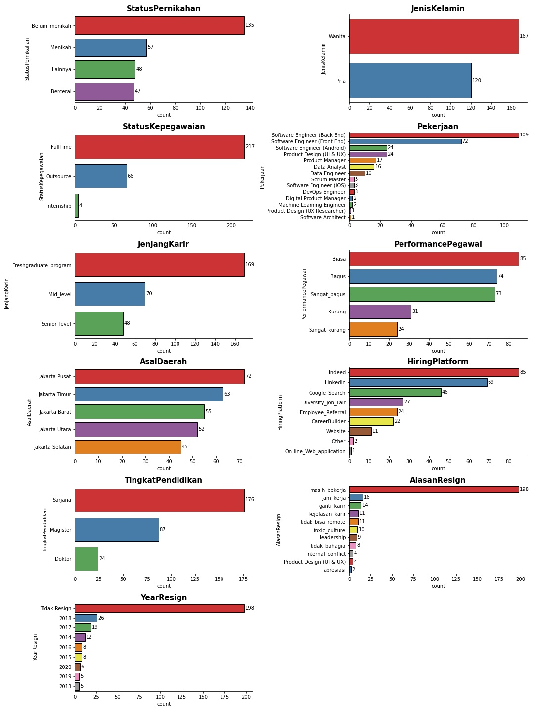
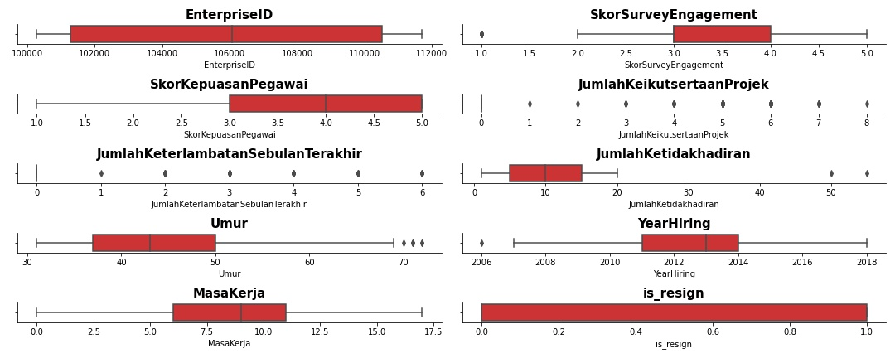

## Multivariate Analysis

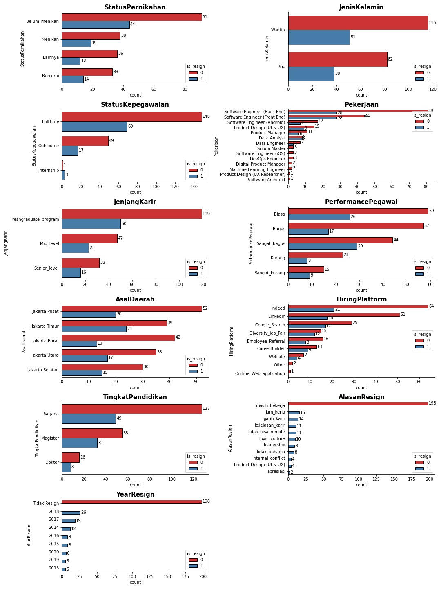
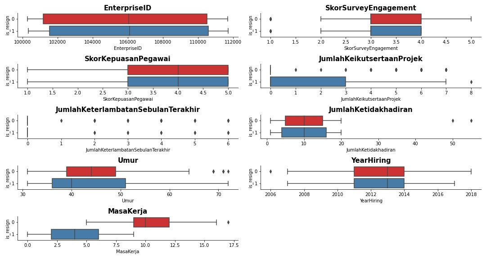

There is significant difference in 'MasaKerja' distribution on employee resign.

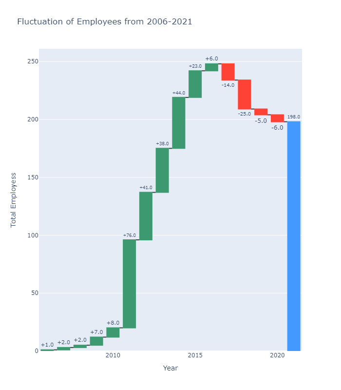

There is consecutive employment decrease from 2017 to 2020. This is condition make a lot of position are vacant, that can affect company performance. Moreover it can make decrease of employee satisfaction due to higher workload.

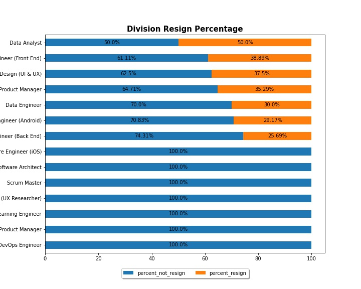

From resign percentage in divisions data analyst were the highest resign percentage in the company and need analyze forward to know the reason for this condition.

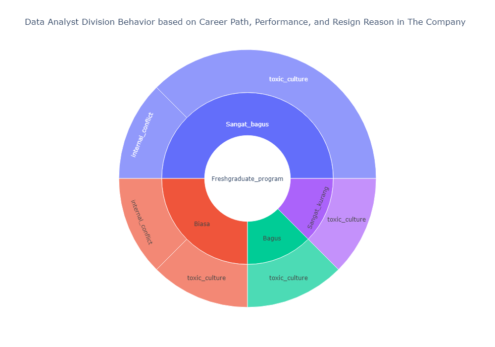

Resign employee from data analyst division were from Fresh graduate program, mostly they have good performance and the potential reason they resign is because toxic culture.

# Data Preprocessing
Select some feature that have potential relation with employee resign factors but does not have leak information about is_resign value such as ‘Year Resign’,’Alasan Resign.There is outliers in ‘SkorSurveyEngagement’ and ‘Umur’ column, we handle this with zscore. We do some label encoding and one hot encodig for some categorical features. Scale 'Umur data with normalization and oversampling target variable with SMOTE.

# Machine Learning Modeling
We trial some classifier model to get the most optimal model for this problem.
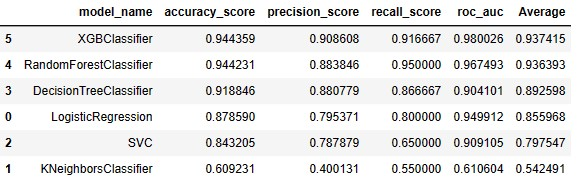

We choose XGBClassifier model because have highest average metric.

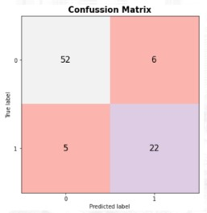

From confusion matrix model is well to predict the test data with about ~10% miss to predict negative target.

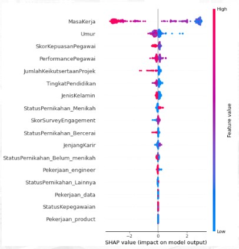

‘Masa Kerja’ have high shape value and indicate lower ‘Masa Kerja’ having high possibility to get resign.

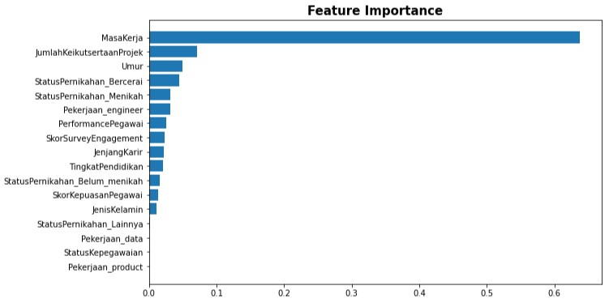

On feature importance ‘Masa Kerja’ have highest importance compare to another feature. It is mean that ‘Masa Kerja’ feature give high possibility for employee to resign.

# Summary
We can conclude that to maintain employee fluctuation is to build strong culture, give more leadership atitude and growth program for each employee. 'Masa Kerja' is most importance factor to know resignation of a employee, higher 'MasaKerja' lower chance employee to resign.

